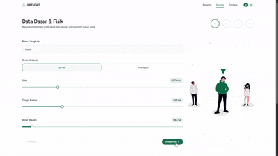

# Obesight AI

**Never screen your obesity risk blindly again.**

Have you ever struggled to understand your physical evaluation and obesity risk factors due to confusing medical numbers and complex statistics?

**Obesight AI** helps you monitor, assess, and understand your obesity risk level and provides personalized lifestyle recommendations using a high-performance machine learning model (Random Forest) and an interactive bilingual dashboard.

## Preview

### Dashboard & Analytics


### Interactive Screening Wizard


## What It Does

- **Risk Classification** → Classifies body conditions into 7 categories of obesity and weight levels.
- **Bilingual Interface** → Instant full-stack toggling between Indonesian and English for both the UI and recommendations.
- **Personalized Action Plan** → Generates tailored daily habit suggestions based on your eating, exercise, and hydration levels.
- **Fast Analytics** → Instant ML pipeline inference responding in milliseconds.

## How It Works

### 1. Questionnaire Submission
- The user fills out a 4-step wizard form capturing physical attributes, eating patterns, activity frequencies, and daily habits.

### 2. ML Model Inference
- Input features are normalized and processed by a pre-trained **Random Forest Classifier** pipeline to identify weight risk categories.

### 3. Dynamic Recommender
- The backend matches ML predictions and user answers to compile a targeted list of daily lifestyle, hydration, and exercise guidelines.

### 4. Interactive Dashboard
- Renders an interactive results dashboard featuring a BMI gauge, AI probability distribution charts, and a checkable action plan.

## Architecture & Component Details

Obesight AI is designed using a clean, decoupled monorepo architecture divided into three core pillars:

### 1. Frontend (Presentation Layer)
The frontend is a modern, responsive single-page application built with **React 18**, **TypeScript**, and **Vite**, focused on user accessibility and visual feedback.
- **Form Wizard State Management**: Multi-step user inputs are managed using a unified React Context (`FormContext`) to prevent data loss when navigating back and forth between questionnaire steps.
- **Full Localization (i18n)**: Integrated using `react-i18next`, enabling real-time language toggling (Indonesian ↔ English) across all UI elements, forms, and backend-generated health insights.
- **Dynamic Analytics Dashboard**: Renders interactive SVG components, including a custom BMI Gauge aligning with WHO ranges, and horizontal confidence bar charts built with **Recharts** displaying model class probabilities.
- **Micro-Animations**: Employs **GSAP (GreenSock)** for high-performance transitions, rendering smooth step-switching animations and dashboard animations.

### 2. Backend (API & Insights Layer)
The backend is a high-performance, stateless REST API built using **FastAPI** and **Python 3.11+**, acting as the bridge between user inputs and the ML model.
- **Stateless Inference Engine**: Loads the pre-trained `best_model.pkl` pipeline into memory upon server startup, resolving classification predictions in milliseconds.
- **Automated Data Validation**: Uses Pydantic v2 schemas to validate input data integrity, sanitizing user inputs (e.g., converting height from centimeters to meters) before feeding them to the model.
- **Bilingual Recommender Engine**: A rule-based engine that processes user answers alongside model classification to compile localized daily guidelines (e.g., exercise frequency, hydration, and nutrition checklists) dynamically matching the client's language selection.
- **Interactive Documentation**: Auto-generates interactive API playgrounds using Swagger UI (`/docs`) and ReDoc (`/redoc`).

### 3. Machine Learning (Inference & Pipeline Development)
The ML layer manages the model life cycle, from data preprocessing to model serialization.
- **Preprocessing Pipeline**: Integrates Scikit-Learn transformers (`ColumnTransformer`) utilizing `StandardScaler` for numerical values (Age, Height, Weight, etc.) and encoders (`OneHotEncoder`/`OrdinalEncoder`) for categorical parameters.
- **Model Comparison & Evaluation**: Baseline training runs compare 5 core estimators (KNN, SVM, RandomForest, XGBoost, and LightGBM) on stratified validation splits.
- **Hyperparameter Optimization**: Uses **Optuna** to perform cross-validated trial searches for optimal classifier tuning.
- **Experiment Tracking**: Utilizes **MLflow** with a local SQLite backend to log runs, hyperparameters, and metrics (accuracy, recall, precision, f1-score).
- **Production Serialization**: Exports the finalized winning model pipeline to a single, portable `best_model.pkl` binary via `joblib`.

## Model Evaluation

Multiple machine learning model pipelines were trained and evaluated on stratified validation splits. Below are the performance metrics compiled from training runs:

| Model Candidate | Accuracy | F1-Score | Precision | Recall |
| :--- | :---: | :---: | :---: | :---: |
| **Tuned Random Forest (Best)** | **99.28%** | **99.28%** | **99.30%** | **99.28%** |
| Baseline Random Forest | 99.04% | 99.04% | 99.06% | 99.04% |
| Baseline LightGBM | 98.56% | 98.56% | 98.60% | 98.56% |
| Baseline XGBoost | 98.33% | 98.32% | 98.36% | 98.33% |
| Baseline SVM | 94.50% | 94.49% | 94.53% | 94.50% |
| Baseline KNN | 86.12% | 85.28% | 86.63% | 86.12% |

The winning model (**Tuned Random Forest**) achieved **99.28% validation accuracy** and is exported as the production inference pipeline (`best_model.pkl`).

### Experiment Tracking (MLflow)

All model training cycles, baseline comparison runs, and hyperparameter tuning trials are logged automatically to a local SQLite-backed MLflow tracking server. This records parameter spaces, model artifacts, and key performance metrics (accuracy, precision, recall, f1-score). See step 4 of the [Quick Start](#4-optional-run-the-mlflow-dashboard) below to launch the dashboard locally.

## Project Architecture

```
obesight-ai/
├── backend/            # FastAPI application (API layer)
│   ├── app/
│   │   ├── api/        # API routers & schema definitions
│   │   ├── core/       # Configurations & environment settings
│   │   └── services/   # Predictor & Recommender logic
│   └── tests/          # Integration & unit tests
│
├── frontend/           # React + TS + Vite application (Presentation layer)
│   ├── src/
│   │   ├── components/ # Reusable UI components & Dashboard cards
│   │   ├── context/    # Global form state management
│   │   ├── locales/    # Translations (id.json, en.json)
│   │   ├── pages/      # Page components (Landing, About, Wizard, Result)
│   │   └── main.tsx    # Frontend entry point
│   └── public/         # Static public assets
│
├── ml/                 # Machine learning training & pipeline development
│   ├── dataset/        # Training dataset files
│   ├── models/         # Serialized LightGBM models (.pkl)
│   ├── notebooks/      # Jupyter notebooks for EDA and experimentation
│   └── src/            # Preprocessing & training python modules
│
├── docs/               # Technical specs & user guides
└── README.md           # Master project documentation
```

## Technology Stack

### Frontend
- **React 18** & **TypeScript**
- **Vite** → Fast module bundler & dev server
- **Tailwind CSS** → Modern utility-first CSS styling
- **react-i18next** → Internationalization framework
- **Recharts** → SVG charts library
- **GSAP (GreenSock)** → High-performance user interface animations

### Backend
- **FastAPI** → Modern, high-performance web framework for Python APIs
- **Uvicorn** → Lightning-fast ASGI server implementation
- **Pydantic** → Data validation and settings management using Python type hints
- **Joblib** & **Scikit-Learn** → ML pipeline serialization and inference

### Machine Learning
- **LightGBM** → Gradient boosting framework
- **Pandas** & **NumPy** → Data manipulation & engineering
- **Seaborn** & **Matplotlib** → Data visualization during EDA

## Quick Start

### 1. Clone the Repository
```bash
git clone https://github.com/Falrlz/obesight-ai.git
cd obesight-ai
```

### 2. Run the Backend API
```bash
cd backend
# Create and activate a virtual environment
python -m venv .venv
# On Windows:
.venv\Scripts\activate
# On macOS/Linux:
source .venv/bin/activate

# Install dependencies
pip install -r requirements.txt

# Run server
uvicorn app.main:app --reload
```
The API documentation will be available at `http://127.0.0.1:8000/docs`.

### 3. Run the Frontend App
```bash
cd ../frontend
# Install packages
npm install

# Run dev server
npm run dev
```
Open your browser and navigate to `http://localhost:5173`.

### 4. Run the MLflow Dashboard
To view model training runs, baseline comparisons, and hyperparameter tuning trials:
```bash
cd ../ml
# Start the local server pointing to the tracking database
..\.venv\Scripts\mlflow ui --backend-store-uri sqlite:///mlruns/mlruns.db
```
Open your browser and navigate to `http://127.0.0.1:5000`.

## Environment Configuration

Configure the backend `.env` variables:
```env
MODEL_PATH=../ml/models/best_model.pkl
# Add other configurations if needed
```

## Disclaimer

- **Obesight AI** is a quick lifestyle screening tool designed for initial assessment and educational purposes.
- Predictions and recommendations generated by this tool are **not substitutes for professional medical advice, diagnosis, or treatment**. Always consult a qualified medical professional for health concerns.

## Acknowledgements

This project uses the dataset and research from the following sources for machine learning training and screening criteria guidelines:

- **Dataset**: [Obesity Dataset on Kaggle](https://www.kaggle.com/datasets/suleymansulak/obesity-dataset) compiled by Süleyman Alpaslan Sulak.
- **Research Article**:
  - **Title**: *Using Artificial Intelligence Techniques for the Analysis of Obesity Status According to the Individuals' Social and Physical Activities*
  - **Authors**: Nigmet Koklu, Süleyman Alpaslan Sulak
  - **Journal**: Sinop University Journal of Natural Sciences, Vol. 9, No. 1, pp. 217-239 (2024)
  - **DOI**: [10.33484/sinopfbd.1445215](https://doi.org/10.33484/sinopfbd.1445215)
  - **Article Link**: [DergiPark Article Publication](https://dergipark.org.tr/en/pub/sinopfbd/article/1445215)
