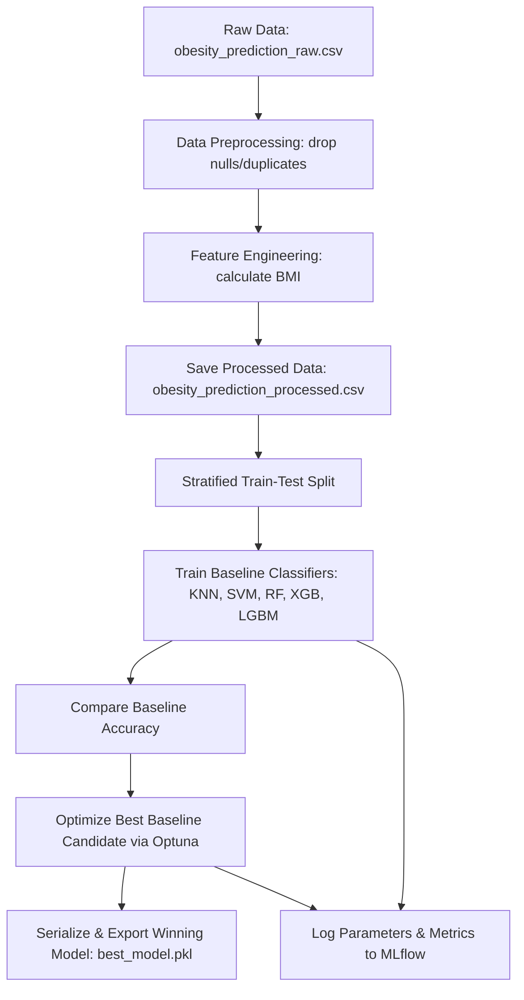

# Obesity Prediction ML Pipeline

A clean, modular, and production-ready Machine Learning pipeline designed for classification of client obesity levels. The project implements data preprocessing, automated feature engineering, baseline model evaluation, hyperparameter tuning with Optuna, experiment tracking with MLflow, and automated model export.

---

## 📁 Directory Structure

```text
ml/
├── dataset/             # Data directory
│   ├── raw/             # Raw input dataset (obesity_prediction_raw.csv)
│   └── processed/       # Cleaned and engineered dataset
├── models/              # Serialized winning models (.pkl)
├── notebooks/           # Exploratory Data Analysis & experimentation
├── pipelines/           # End-to-end pipeline scripts
│   ├── data_prep_pipeline.py
│   ├── train_pipeline.py
│   └── full_pipeline.py
├── src/                 # Reusable source modules
│   ├── config/          # Project configurations & tuning spaces
│   ├── data/            # Data loader & train-test splitter
│   ├── features/        # Data cleaning & feature engineering (BMI)
│   ├── models/          # Model building, training, tuning, & evaluation
│   └── utils/           # Shared logger & warning suppressor
├── tests/               # Unit testing suite
└── requirements.txt     # Python dependencies
```

---

## 🔄 Project Workflow

The machine learning workflow is structured as an end-to-end pipeline:



---

## 🛠️ Setup & Installation

1. Make sure you have Python 3.11+ installed.
2. Initialize and activate the virtual environment:
   ```bash
   # Windows
   python -m venv .venv
   .venv\Scripts\activate

   # macOS/Linux
   python -m venv .venv
   source .venv/bin/activate
   ```
3. Install the required dependencies:
   ```bash
   pip install -r requirements.txt
   ```

---

## 🚀 Running the Pipeline

To execute the entire end-to-end pipeline (Preprocessing ➔ Training ➔ Tuning ➔ Evaluation ➔ Model Export), run the following command from the `ml/` directory:

```bash
cd ml
..\.venv\Scripts\python.exe -m pipelines.full_pipeline
```

### Pipeline Details
- **Data Preparation**: Cleans raw data, calculates the engineered `BMI` feature, and saves the result to `dataset/processed/`.
- **Baseline Training**: Evaluates 5 classifiers (KNN, SVM, RandomForest, XGBoost, LightGBM) on stratified splits.
- **Hyperparameter Tuning**: Dynamically runs Optuna cross-validation trials on the best baseline candidate.
- **Model Tracking**: Logs model runs, parameters, and accuracy metrics to a local SQLite-backed MLflow database.
- **Model Export**: Serializes the final winning model pipeline to `models/best_model.pkl`.

---

## 📊 MLflow Experiment Tracking

Every model run, its parameters, evaluation metrics (accuracy, precision, recall, etc.), and the trained model artifact are tracked locally.

To launch the MLflow User Interface:

1. Open your terminal in the `ml/` directory.
2. Run the MLflow UI server (using the active virtual environment or direct path):
   - **With virtual environment activated:**
     ```bash
     mlflow ui --backend-store-uri sqlite:///mlruns/mlruns.db
     ```
   - **Using direct path (Windows):**
     ```bash
     ..\.venv\Scripts\mlflow ui --backend-store-uri sqlite:///mlruns/mlruns.db
     ```
3. Open your web browser and navigate to:
   ```text
   http://127.0.0.1:5000
   ```
4. In the UI, you can compare baseline runs, inspect the hyperparameter tuning progress, and view model evaluation charts.

---

## 🧪 Running Tests

To run the unit tests verifying pipeline integrity:

```bash
cd ml
..\.venv\Scripts\python.exe -m pytest
```
