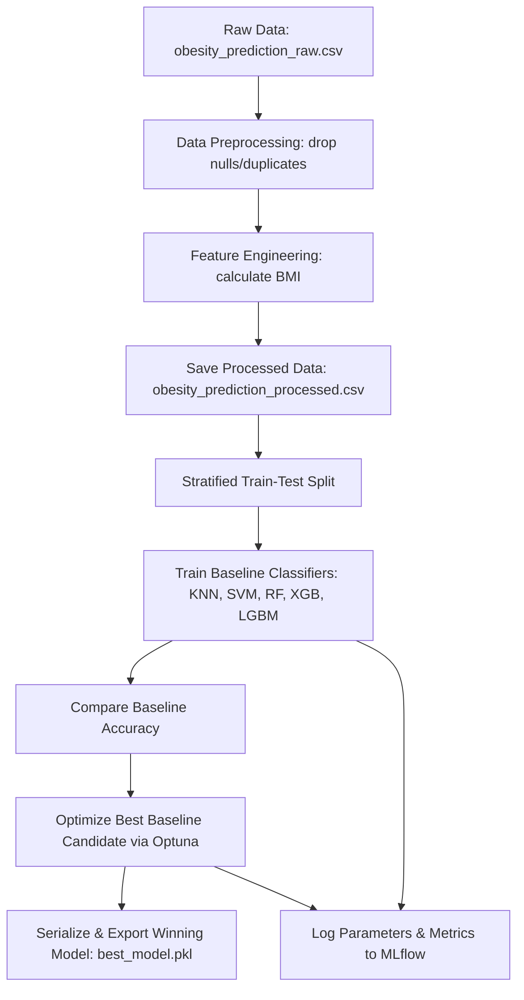

# Obesity Prediction Machine Learning Pipeline

This sub-project hosts the complete end-to-end Machine Learning pipeline designed to classify individuals into 7 categories of obesity and weight levels. It implements structured data preprocessing, automated feature engineering (BMI calculation), baseline model training, hyperparameter optimization via **Optuna**, experiment tracking using **MLflow**, and production serialization.

---

## 📂 Directory Structure

```text
ml/
├── dataset/             # Data directory
│   ├── raw/             # Raw input dataset (obesity_prediction_raw.csv)
│   └── processed/       # Cleaned and engineered dataset (obesity_prediction_processed.csv)
├── models/              # Serialized winning production models (.pkl)
├── notebooks/           # Exploratory Data Analysis (EDA) & research notebooks
├── pipelines/           # End-to-end orchestrator scripts
│   ├── data_prep_pipeline.py
│   ├── train_pipeline.py
│   └── full_pipeline.py
├── src/                 # Reusable pipeline modules
│   ├── config/          # Configurations, feature partitions, & hyperparameter spaces
│   ├── data/            # Data loader & stratified splitting helpers
│   ├── features/        # Preprocessing, encoding, and engineering (BMI)
│   ├── models/          # Model declarations, Optuna tuning, and evaluation
│   └── utils/           # Shared logger & warning suppressor
├── tests/               # Unit testing suite for pipeline components
└── requirements.txt     # Python dependencies
```

---

## 📊 Dataset Specifications

The machine learning model is trained on the **Obesity Dataset** (compiled via online surveys containing 1,610 samples), capturing anthropometric measurements and daily lifestyle/behavioral habits.

### 1. Target Classes
The target column `Obesity` is classified into 7 distinct weight and obesity levels:
* `Insufficient_Weight` (Weight Level 0)
* `Normal_Weight` (Weight Level 1)
* `Overweight_Level_I` (Weight Level 2)
* `Overweight_Level_II` (Weight Level 3)
* `Obesity_Type_I` (Weight Level 4)
* `Obesity_Type_II` (Weight Level 5)
* `Obesity_Type_III` (Weight Level 6)

### 2. Feature Breakdown
The model processes **16 input features** categorized as follows:

| Feature Name | Feature Type | Description |
| :--- | :--- | :--- |
| `Age` | Numerical | Age of the individual in years |
| `Height` | Numerical | Height of the individual in meters (raw values are scaled) |
| `Weight` | Numerical | Weight of the individual in kilograms |
| `BMI` | Numerical | *Engineered Feature*: Body Mass Index calculated as $\text{Weight} / \text{Height}^2$ |
| `FCVC` | Numerical | Frequency of consumption of vegetables (1 = Never, 2 = Sometimes, 3 = Always) |
| `NCP` | Numerical | Number of main meals per day (1, 2, 3, or more than 3) |
| `CH2O` | Numerical | Daily water consumption (1 = 1-2 Liters, 2 = 2-3 Liters, 3 = More than 3 Liters) |
| `FAF` | Numerical | Physical activity frequency per week (0 = None, 1 = 1-2 Days, 2 = 3-4 Days, 3 = 5-6 Days) |
| `TUE` | Numerical | Time using technology devices (0 = 0-2 Hours, 1 = 3-5 Hours, 2 = More than 5 Hours) |
| `Gender` | Binary | Gender of the individual (`Male`, `Female`) |
| `family_history` | Binary | Family history of overweight/obesity (`yes`, `no`) |
| `FAVC` | Binary | Frequent consumption of high caloric food (`yes`, `no`) |
| `SMOKE` | Binary | Smoking habit (`yes`, `no`) |
| `SCC` | Binary | Calories monitoring daily (`yes`, `no`) |
| `CAEC` | Ordinal | Consumption of food between meals (`no`, `Sometimes`, `Frequently`, `Always`) |
| `CALC` | Ordinal | Alcohol consumption frequency (`no`, `Sometimes`, `Frequently`, `Always`) |
| `MTRANS` | Nominal | Main transportation mode (`Public_Transportation`, `Walking`, `Automobile`, `Motorbike`, `Bike`) |

---

## 🔄 Project Workflow & Pipelines

The ML lifecycle is split into separate execution pipelines to support modular deployment:



### 1. Data Preprocessing & Feature Engineering
Located in `src/features/preprocessing.py`, the preprocessing pipeline handles data type transformations and normalization before feeding features to the classifier:
* **BMI Calculation**: Dynamically computes Body Mass Index to serve as a high-correlation predictor column.
* **Numerical Scaling**: Uses `StandardScaler` to normalize features (`Age`, `Height`, `Weight`, `BMI`, `FCVC`, `NCP`, `CH2O`, `FAF`, `TUE`).
* **Categorical Encoding**:
  * **Binary features** are converted into binary flags.
  * **Nominal features** (`MTRANS`) are encoded via `OneHotEncoder` to avoid dummy variable traps.
  * **Ordinal features** (`CAEC`, `CALC`) are mapped to sequential numeric categories (0 to 3) matching their logical frequency order.

### 2. Model Training & Evaluation
The training pipeline compares 5 baseline algorithms using a **Stratified Train-Test Split (80% train, 20% test)** to maintain consistent class proportions:
1. **K-Nearest Neighbors (KNN)**
2. **Support Vector Machine (SVM)**
3. **Random Forest Classifier**
4. **XGBoost Classifier**
5. **LightGBM Classifier**

### 3. Hyperparameter Tuning
The pipeline identifies the best-performing baseline candidate and optimizes its parameters using **Optuna** over 3-fold cross-validation (`CV_FOLDS = 3`).
* **Tuning Space Configuration**: Defined in `src/config/config.py` (e.g. estimators, max depth, subsamples, learning rates, etc.).
* **Winning Model Selection**: If the tuned parameters yield a higher test accuracy score than the default baseline, the tuned model is selected for production.

---

## 🛠️ Setup & Installation

### 1. Initialize Virtual Environment
Make sure you are in the `ml/` sub-project directory:
```bash
# Windows
python -m venv .venv
.venv\Scripts\activate

# macOS/Linux
python -m venv .venv
source .venv/bin/activate
```

### 2. Install Dependencies
```bash
pip install --upgrade pip
pip install -r requirements.txt
```

---

## 🚀 Running the Pipelines

You can run individual pipelines or trigger the entire workflow end-to-end:

### 1. Run the Full End-to-End Pipeline
Executes preprocessing, training, tuning, and serialization sequentially:
```bash
# Execute from the ml/ directory
..\.venv\Scripts\python.exe -m pipelines.full_pipeline
```

### 2. Run Data Preprocessing Only
Cleans the raw dataset, computes BMI, and saves the output to `dataset/processed/`:
```bash
..\.venv\Scripts\python.exe -m pipelines.data_prep_pipeline
```

### 3. Run Training & Tuning Only
Loads the preprocessed data, runs training benchmarks, tunes hyperparameters, and exports the model:
```bash
..\.venv\Scripts\python.exe -m pipelines.train_pipeline
```

---

## 📊 MLflow Experiment Tracking

Every model training run, baseline comparison, and Optuna tuning trial is recorded locally in a SQLite-backed database (`mlruns/mlruns.db`).

### Launch the Dashboard Local Server
To launch the interactive MLflow UI server and compare runs:
```bash
# Run inside the ml/ directory
..\.venv\Scripts\mlflow ui --backend-store-uri sqlite:///mlruns/mlruns.db
```
Open your browser and navigate to: **[http://127.0.0.1:5000](http://127.0.0.1:5000)**

---

## 🧪 Running Unit Tests

Automated unit tests ensure pipeline stability and prevent regressions in calculations (e.g., BMI formula, data splits):
```bash
# Run unit tests from the ml/ directory
..\.venv\Scripts\python.exe -m pytest
```
